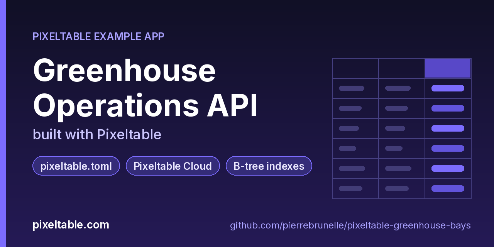

<!-- pixeltable-example-app: 20261004-greenhouse-bays -->
# Greenhouse Operations API built with Pixeltable



[](https://codespaces.new/pierrebrunelle/pixeltable-greenhouse-bays?quickstart=1)
[](https://pixeltable.com)
[](https://pypi.org/project/pixeltable/)
[](https://github.com/pixeltable/pixeltable)
[](LICENSE)

Track greenhouse bays, their climate readings and what's planted in them. Each reading gets a **climate band** and a **vapour-pressure deficit (VPD)** as computed columns, bays are looked up through explicit **B-tree indexes** on zone, status and crop, and the whole project is configured in one **`pixeltable.toml`**: the local catalog and a Pixeltable Cloud database with its CPU, memory, disk and worker settings.

[Pixeltable](https://pixeltable.com) is open-source, Python-native **multimodal AI data infrastructure**: tables, incremental computed columns, UDFs, indexes and serving in one library, running locally or on Pixeltable Cloud.

> ⭐ **Like this example?** Star [pixeltable/pixeltable](https://github.com/pixeltable/pixeltable) on GitHub. It helps other developers find it.

## What this example shows

- **`pixeltable.toml` project config**: local and Pixeltable Cloud database sizing in one file
- **Pixeltable Cloud lifecycle** from the `pxt` CLI (`db`, `schema`, `service`)
- **B-tree indexes** declared on the model (`__indexes__`) back the lookup queries
- **Incremental computed columns** powered by plain Python UDFs (`@pxt.udf`)
- **FastAPI serving**: one `FastAPIRouter` turns tables and `@pxt.query` functions into typed REST routes (insert, update, delete, compute and query) with OpenAPI docs
- **Importable UDF module**: UDFs live in `udfs.py`; tables, queries and routes live together in `app.py` (Pixeltable resolves UDFs by module path)
- **`pixeltable.toml`** declares a local database and a **Pixeltable Cloud** database, so the same code deploys with `pxt db update`

## `pixeltable.toml` is the deployment

```toml
[[pixeltable.database]]
name = 'pxt://<your-org>:<your-db>'
cpu = 0.5
memory_mb = 1536
disk_gb = 10
workers = 1
```

- **Capacity is configuration.** Edit `memory_mb` (or `cpu`, `disk_gb`), then run `pxt db diff pxt://<your-org>:<your-db>` to see the pending change and `pxt db update pxt://<your-org>:<your-db>` to apply it. `pxt db status` shows the new size.
- **Bad config fails fast.** A malformed file (say, a missing `]]`) is rejected when it's parsed, and invalid values (for example `cpu = 'half-a-core'`) are rejected before anything is created, so a typo can't half-apply.
- **One worker per database for now.** Keep `workers = 1`.
- The `exclude` lists keep virtual envs, logs and local media out of what gets uploaded.

## Indexes on the lookup columns

`Bays` sets `has_default_idxs=False` and declares `pxt.BtreeIndex` on `zone`, `status` and `crop`, the columns the `open_bays` query and the dashboard filter on. Readings and plantings index `bay_id`. `pxt idxs greenhouse/bays` lists them.

## What's inside

| File | What it is |
|------|------------|
| `.devcontainer/devcontainer.json` | GitHub Codespaces / Dev Container config: Python 3.12, installs `requirements.txt`, forwards port 8000 |
| `.github/social-preview.png` | Social preview image (1280x640) |
| `CITATION.cff` | Citation metadata (authors, license, release date, keywords) |
| `app.py` | The app: tables declared as Python classes, `@pxt.query` functions, and the `FastAPIRouter` routes |
| `client_demo.py` | Classify climate, list open bays, plant a bay and log readings through the API |
| `pixeltable.toml` | Project config: the local database plus a Pixeltable Cloud database (sizing, deploy excludes) |
| `seed.py` | Seed five bays, three readings and two plantings |
| `udfs.py` | Pixeltable UDFs (`@pxt.udf`) in their own importable module, imported by `app.py` |
| `requirements.txt` / `pyproject.toml` | Dependencies (`pixeltable[serve]>=0.7.14`) |

**Tables**

| Table | Stored columns | Computed columns |
|-------|---------|------------------|
| `bays` | `bay_id`, `zone`, `crop`, `status` | `label` |
| `readings` | `bay_id`, `taken_at`, `temp_c`, `humidity_pct` | `id`, `band`, `vpd` |
| `plantings` | `bay_id`, `crop`, `planted_on`, `status` | `id` |

**API routes** (service `greenhouse_api`)

| Method | Path | Kind | Backed by | Notes |
|--------|------|------|-----------|-------|
| `POST` | `/bays` | insert | `Bays` |  |
| `POST` | `/bays/status` | update | `Bays` |  |
| `POST` | `/readings` | insert | `Readings` |  |
| `POST` | `/plantings` | insert | `Plantings` |  |
| `POST` | `/climate-band` | compute | `Readings` |  |
| `GET` | `/bays/open` | query | `open_bays` |  |
| `GET` | `/bays/climate` | query | `bay_climate` |  |

## Run in your browser (GitHub Codespaces)

[](https://codespaces.new/pierrebrunelle/pixeltable-greenhouse-bays?quickstart=1)

1. Click **Open in GitHub Codespaces** above (or [this link](https://codespaces.new/pierrebrunelle/pixeltable-greenhouse-bays?quickstart=1)). The dev container installs Python 3.12 and `pixeltable[serve]>=0.7.14` from `requirements.txt`.
2. In the codespace terminal, create the tables, seed them and start the API:

   ```bash
   pxt schema update app.py greenhouse
   python seed.py greenhouse
   pxt service run app.py greenhouse --port 8000   # open http://localhost:8000/docs
   python client_demo.py                          # in another terminal
   pxt idxs greenhouse/bays                       # the B-tree indexes
   ```

3. Codespaces forwards port 8000: open it from the **Ports** tab (or the pop-up) and add `/docs` to the URL for the interactive OpenAPI docs.

## Quickstart

Requires Python 3.11+ and `pixeltable[serve]>=0.7.14`.

```bash
git clone https://github.com/pierrebrunelle/pixeltable-greenhouse-bays.git
cd pixeltable-greenhouse-bays
python -m venv .venv && source .venv/bin/activate
pip install -r requirements.txt

# Create the tables in a local catalog directory named `greenhouse`
pxt schema update app.py greenhouse

python seed.py greenhouse
pxt service run app.py greenhouse --port 8000   # open http://localhost:8000/docs
python client_demo.py                          # in another terminal
pxt idxs greenhouse/bays                       # the B-tree indexes
```

Try it:

```bash
curl -s -X POST localhost:8000/climate-band -H 'Content-Type: application/json' -d '{"temp_c": 33.0, "humidity_pct": 88.0}'
curl -s 'localhost:8000/bays/open?zone=north'
```

## Deploy to Pixeltable Cloud

The same `app.py` runs on [Pixeltable Cloud](https://pixeltable.com). Sign in (or get a free trial database with `pxt new`), point the second database entry in `pixeltable.toml` at your own database, then deploy:

```bash
pxt login                       # or: export PIXELTABLE_API_KEY=<your-api-key>
# edit pixeltable.toml: name = 'pxt://<your-org>:<your-db>'
pxt db update pxt://<your-org>:<your-db>                 # build the image and upload the project
pxt schema update app.py pxt://<your-org>:<your-db>/greenhouse   # create the tables in the hosted database
pxt service update app.py pxt://<your-org>:<your-db>/greenhouse  # start the API there
pxt service list pxt://<your-org>:<your-db>              # list hosted services
```

Hosted routes require an API key: send it in the `X-api-key` header (for example `-H "X-api-key: $PIXELTABLE_API_KEY"`). Keep keys in environment variables or `pxt secret set`, never in code.

## Code walkthrough

**1. Business logic is plain Python, in `udfs.py`.** A `@pxt.udf` function can be used as a column expression. Pixeltable records UDFs by module path (`udfs.climate_band`), so they live in their own importable module rather than inline in the app: the daemon, serving workers and Pixeltable Cloud import it again by that path.

```python
# udfs.py
@pxt.udf
def climate_band(temp_c: float, humidity_pct: float) -> str:
    """cold / ok / humid / stress from temperature and relative humidity."""
    if temp_c >= 32 or humidity_pct >= 85:
        return 'stress'
    if temp_c < 12:
        return 'cold'
    return 'humid' if humidity_pct >= 75 else 'ok'
```

**2. Tables are Python classes (`app.py`).** Annotated attributes are stored columns; attributes assigned an expression are **computed columns** (`id`, `band`, `vpd`), evaluated incrementally on every insert or update and recomputed when their inputs change. Indexes live next to the columns.

```python
# app.py
class Readings(TableModel, name='readings', has_default_idxs=False):
    id = pxt.Column(value=pxtf.uuid.uuid7(), primary_key=True)
    bay_id: pxt.String
    taken_at: pxt.String
    temp_c: pxt.Float
    humidity_pct: pxt.Float

    band = climate_band(temp_c, humidity_pct)
    vpd = vpd_kpa(temp_c, humidity_pct)

    __indexes__ = [pxt.BtreeIndex(bay_id)]
```

**3. Queries are functions (`app.py`).** `@pxt.query` wraps a Pixeltable query so it can be called from Python or exposed as a route:

```python
# app.py
@pxt.query
def open_bays(zone: str):
    """Open bays in a zone (zone + status indexes)."""
    return Bays.where((Bays.zone == zone) & (Bays.status == 'open')).select(Bays.bay_id, Bays.label).order_by(Bays.bay_id)
```

**4. One router, a full REST API.** `FastAPIRouter` generates request/response models from the column types, validates input, and publishes OpenAPI docs at `/docs`:

```python
# app.py
greenhouse_api = FastAPIRouter(name='greenhouse_api')
greenhouse_api.add_insert_route(Bays, path='/bays', inputs=[Bays.bay_id, Bays.zone, Bays.crop, Bays.status],
                                outputs=[Bays.bay_id, Bays.label])
greenhouse_api.add_update_route(Bays, path='/bays/status', inputs=[Bays.status, Bays.crop],
                                outputs=[Bays.bay_id, Bays.status, Bays.label])
greenhouse_api.add_insert_route(Readings, path='/readings',
                                inputs=[Readings.bay_id, Readings.taken_at, Readings.temp_c, Readings.humidity_pct],
                                outputs=[Readings.id, Readings.band, Readings.vpd])
greenhouse_api.add_insert_route(Plantings, path='/plantings',
                                inputs=[Plantings.bay_id, Plantings.crop, Plantings.planted_on, Plantings.status],
                                outputs=[Plantings.id])
greenhouse_api.add_compute_route(Readings, path='/climate-band', inputs=[Readings.temp_c, Readings.humidity_pct],
                                 outputs=[Readings.band, Readings.vpd])
greenhouse_api.add_query_route(path='/bays/open', query=open_bays, method='get')
greenhouse_api.add_query_route(path='/bays/climate', query=bay_climate, method='get')
```

## Learn more

- 🌐 Website: https://pixeltable.com
- 📚 Docs: https://docs.pixeltable.com
- 💻 Source: https://github.com/pixeltable/pixeltable (⭐ star it if Pixeltable is useful to you)
- 📦 PyPI: https://pypi.org/project/pixeltable/
- 🧩 More example apps: https://pierrebrunelle.github.io/awesome-pixeltable-apps/

**[More Pixeltable example apps →](https://pierrebrunelle.github.io/awesome-pixeltable-apps/)**

---

<sub>Built as part of a daily series of Pixeltable example apps · Pixeltable 0.7.14 · Python, FastAPI, incremental computed columns · Licensed under Apache-2.0.</sub>
